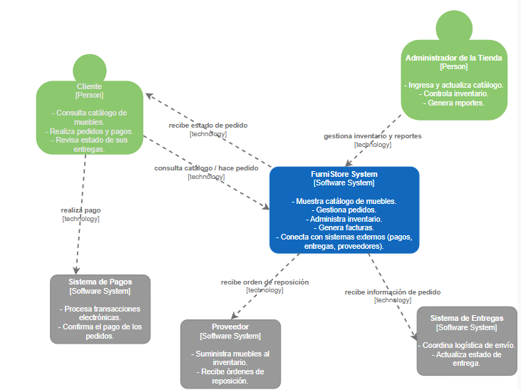
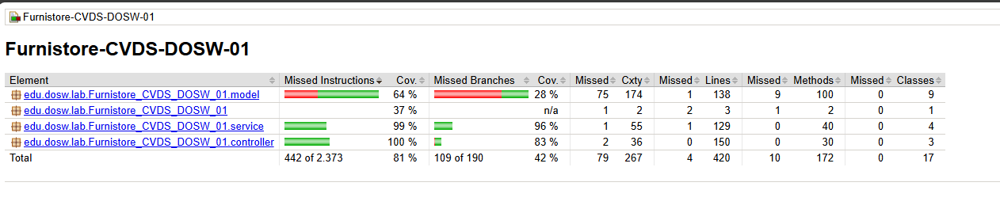
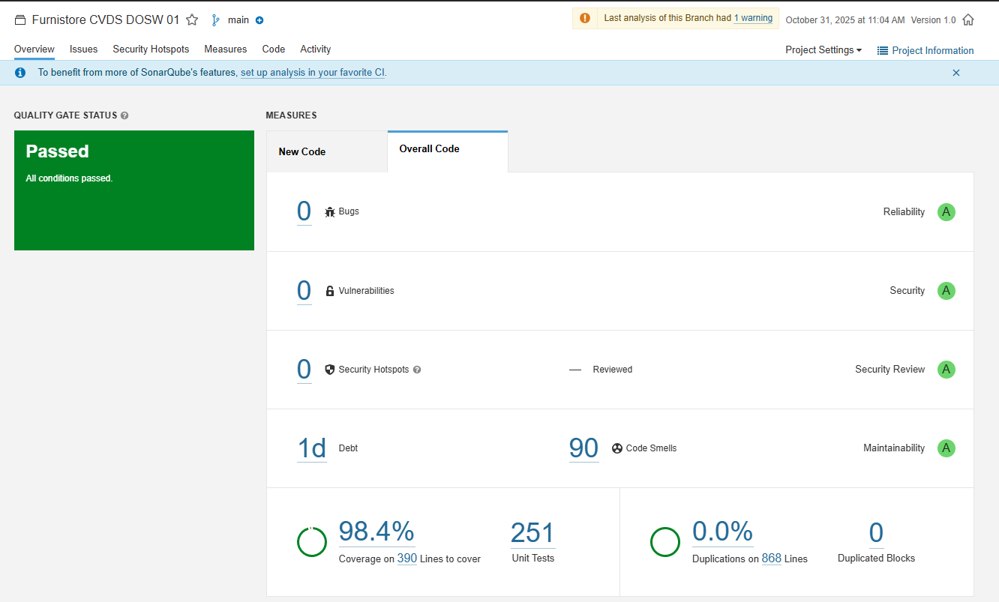
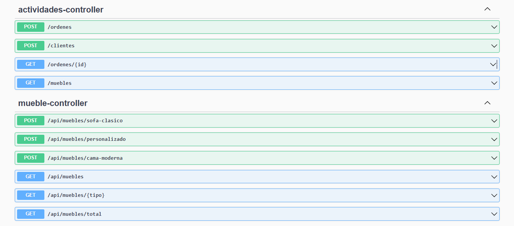
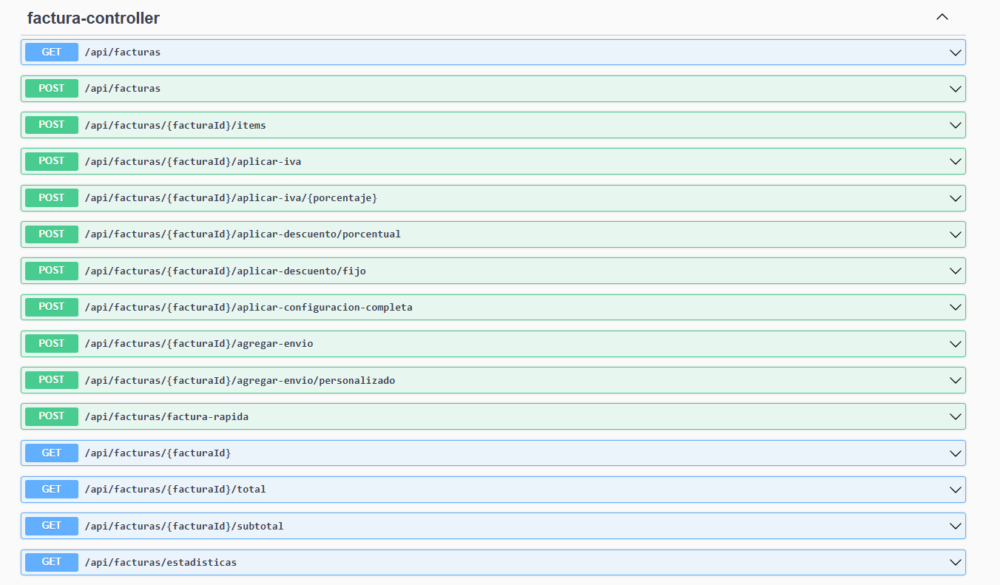

# Furnistore-CVDS-DOSW-01
FurniStore-CVDS-DOSW-01 — Backend académico en Java 17 + Spring Boot para la tienda de muebles FurniStore. Gestiona productos, pedidos, inventario y entregas. Incluye GitFlow, SOLID, patrones de diseño y calidad con JUnit, JaCoCo, SonarQube y Swagger UI.

# Autor:
- Juan Pablo Nieto Cortes
---
El proyecto se ha configurado con las siguientes tecnologías:

- **Java 17** → Lenguaje base.
- **Spring Boot** → Framework para el desarrollo del backend.
- **JUnit 5 + Mockito** → Framework de testing.
- **JaCoCo** → Generación de reportes de cobertura de pruebas.
- **SonarQube** → Análisis de calidad y mantenibilidad del código.
- **Swagger UI (springdoc-openapi)** → Documentación automática y navegable de la API REST.

---
# Estrategia de ramas (GitFlow)

Para garantizar un flujo de trabajo organizado en equipo, se define la estrategia **GitFlow**:

- **main** → Rama principal, siempre estable y desplegable.
- **develop** → Rama de desarrollo, donde se integran las nuevas funcionalidades antes de pasar a `main`.
- **feature/** → Cada funcionalidad nueva se desarrolla en una rama `feature/nombre-funcionalidad`.
- **bugfix/** → Ramas para corregir errores en desarrollo.
- **release/** → Preparación de una versión antes de pasar a `main`.
- **hotfix/** → Correcciones críticas en producción.

---

# Convenciones de commits

Se seguirá la convención **Conventional Commits**:

- **feat:** → Nueva funcionalidad.
- **fix:** → Corrección de errores.
- **test:** → Añadir o mejorar pruebas.
- **docs:** → Cambios en documentación.
- **refactor:** → Refactorización de código sin cambiar funcionalidad.
- **style:** → Cambios de estilo (formato, nombres, espacios).
- **chore:** → Tareas varias (build, config, dependencias).

---

## Patrones de Diseño Implementados

## 1. Builder Pattern
Es un patrón de creación que ayuda a construir objetos paso a paso, separando cómo se crean de cómo se usan.  
En este caso se aplica porque:
- Los muebles tienen muchos atributos configurables.
- Permite armar los muebles de forma flexible.
- Se pueden crear diferentes variantes fácilmente.
- Es útil cuando un objeto puede tener varias combinaciones de propiedades.

---

## Principios SOLID Aplicados

- **SRP (Responsabilidad Única):**  
  Cada clase hace solo una cosa: el *Builder* construye, el *Director* organiza y el *Mueble* guarda datos.

- **OCP (Abierto/Cerrado):**  
  Se pueden agregar nuevos tipos de muebles sin modificar lo que ya existe.

- **LSP (Sustitución de Liskov):**  
  Los *builders* concretos se pueden cambiar sin problema por la interfaz `MuebleBuilder`.

- **ISP (Segregación de Interfaces):**  
  La interfaz `MuebleBuilder` solo tiene los métodos necesarios para construir muebles.

- **DIP (Inversión de Dependencias):**  
  El *Director* trabaja con la interfaz `MuebleBuilder`, no con implementaciones específicas.

---

---
## diagrama de contexto
El diagrama de contexto establece los límites del sistema y sus interacciones con actores externos, fundamental en las fases de análisis de requisitos del ciclo de vida de desarrollo.

## casos de uso 
Fundamento Teórico: Los casos de uso capturan los requisitos funcionales desde la perspectiva del usuario, esencial en la fase de especificación de requisitos del ciclo de vida.

## diagrama de clases:
Fundamento Teórico: Implementa el patrón Builder de GoF, permitiendo la construcción paso a paso de objetos complejos (muebles), facilitando el mantenimiento y extensibilidad del código.

## jacoco

## sonarQube

## swagger

